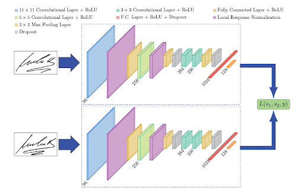

# SignatureIA

## 1. Instalaciones del proyecto:

En las secciones del proyecto van a estar divididas por etapas:

- En el BackEnd hay un README.md para la instalación:

    - Python 3.10.0 (Version necesaria)
    - Instalación y Activación de un Environment de Python
    - Instalación y Ejecución de la API

- En el FrontEnd hay un README.md para la instalación:

    - npm install (node module)
    - Instalación de librerias para lottie animation
    - Instalación de librerias para las fuentes
    
    - Instalación y Activación de un Environment de Python
    - Instalación y Ejecución de la API

 Jupyter Notebook

**1.1. Instalación de maplotlib:**

- pip install numpy pandas matplotlib scikit-learn tensorflow opencv-python pillow
- pip uninstall numpy pandas matplotlib scikit-learn tensorflow opencv-python pillow

## 2. Instalaciones en el proyecto

**2.1. Instalar .env:**

- python -m venv .venv

    **2.1.1. Activación del environment:**
    
    - Activación del .venv en Cmd:
    
        - .venv\Scripts\activate
        
    - Activación del .venv en PowerShell:
    
        - .\.venv\Scripts\Activate.ps1

    **2.1.2. Configuración del environment:**

    - Instalación del Kernel de Jupyter:
    
        - pip install ipykernel

    - Instalación de Jupyter notebook con librerías necesarias (opcionales):
    
        - pip install jupyter numpy pandas matplotlib scikit-learn tensorflow opencv-python pillow

## 3.Actualizaciones de TensorFlow

- pip install --upgrade tensorflow pandas
- pip install --upgrade tensorflow
- pip install pandas==2.0.3

## 4.React Native

**4.1 Instalacion de Node js:**

- [https://nodejs.org/en/download](https://nodejs.org/en/download)

**4.2 Instalación de React Native:**

- npx create-expo-app@latest

**4.3. Inicializar React Native:**

- npx expo start

- cd App
- npm run android
- npm run ios # you need to use macOS to build the iOS project - use the Expo app if you need to do iOS development without a Mac
- npm run web

**4.4 Instalación de modulos:**

- npm install lottie-react-native

## 5.Recursos

### Generador de Firmas

[URL #1](https://onlinesignatures.net/es)

### Siamese Network

[URL #1](https://builtin.com/machine-learning/siamese-network)

[URL #2](https://medium.com/@rinkinag24/a-comprehensive-guide-to-siamese-neural-networks-3358658c0513)